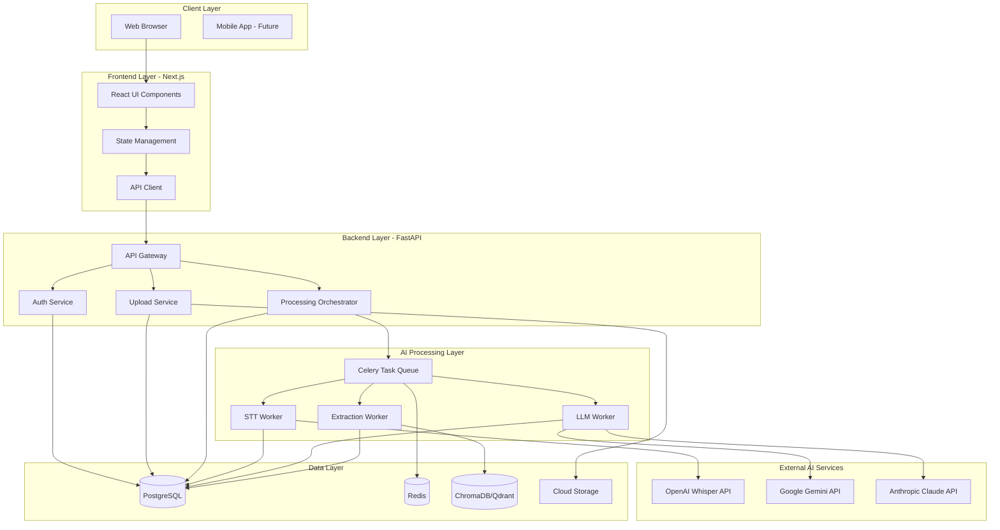
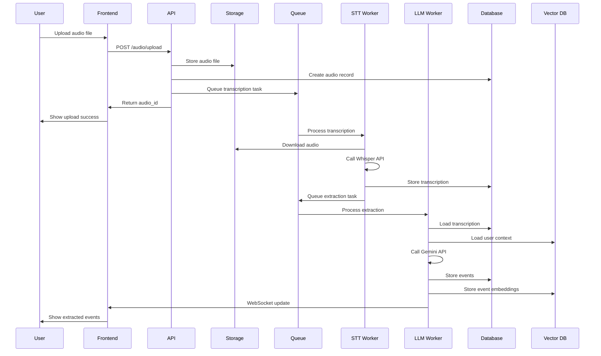
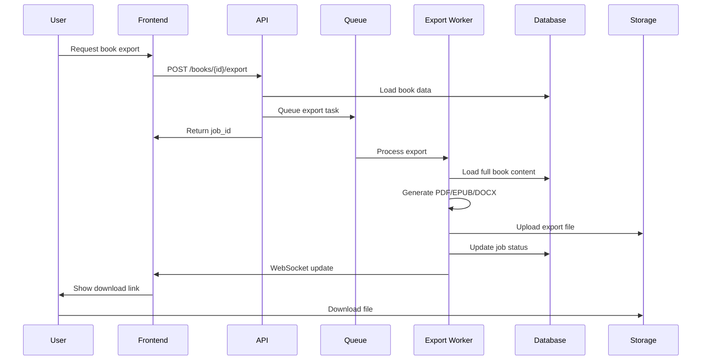
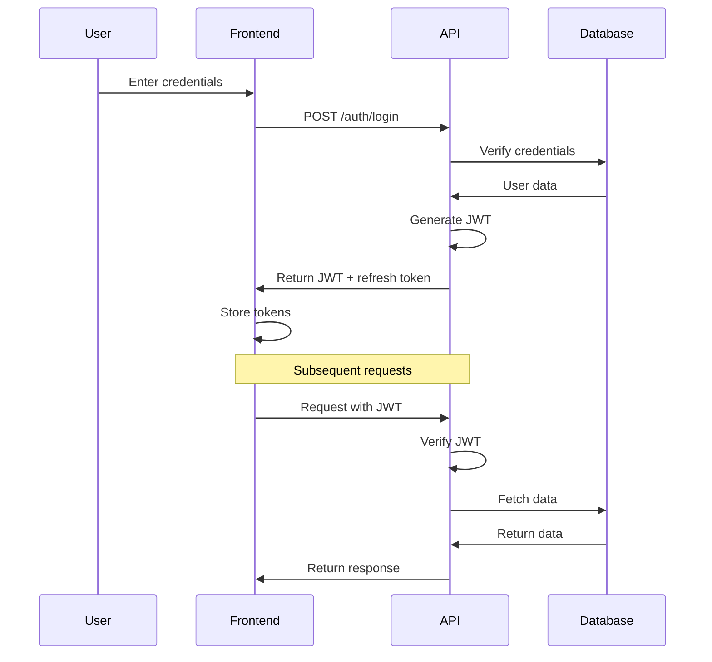

# Architecture Overview

## System Architecture

AI Book Writer is built as a modern, cloud-native application with a clear separation between frontend, backend, and AI processing layers. The architecture is designed for scalability, cost-efficiency, and ease of deployment.

## High-Level Architecture



## Component Details

### 1. Frontend Layer (Next.js)

**Technology**: Next.js 14+ with React, TypeScript, Tailwind CSS

**Responsibilities**:
- User interface rendering
- Client-side state management
- API communication
- Real-time updates via WebSockets
- Audio playback and waveform visualization
- Rich text editing

**Key Components**:
- **Pages/Routes**: 
  - `/` - Landing page
  - `/dashboard` - User dashboard
  - `/upload` - Audio upload interface
  - `/events` - Event management
  - `/chapters` - Chapter organization
  - `/books` - Book assembly
  - `/settings` - User settings

- **Components**:
  - `AudioUploader` - Drag-and-drop audio upload
  - `AudioPlayer` - Synchronized audio playback
  - `TranscriptionEditor` - Edit transcriptions with audio sync
  - `EventCard` - Display and edit events
  - `ChapterBuilder` - Organize events into chapters
  - `BookExporter` - Export configuration and download

**State Management**: Zustand or React Query for server state

**Deployment**: 
- Vercel (recommended for frontend)
- Firebase Hosting
- Static export to any CDN

### 2. Backend Layer (FastAPI)

**Technology**: Python 3.11+, FastAPI, SQLAlchemy, Pydantic

**Responsibilities**:
- RESTful API endpoints
- Authentication and authorization
- Request validation
- Business logic orchestration
- Job scheduling
- WebSocket connections for real-time updates

**Architecture Pattern**: Clean Architecture / Hexagonal Architecture

**Directory Structure**:
```
backend/
├── app/
│   ├── api/
│   │   └── v1/
│   │       ├── auth.py
│   │       ├── audio.py
│   │       ├── transcriptions.py
│   │       ├── events.py
│   │       ├── chapters.py
│   │       └── books.py
│   ├── core/
│   │   ├── config.py
│   │   ├── security.py
│   │   └── dependencies.py
│   ├── models/
│   │   ├── user.py
│   │   ├── audio.py
│   │   ├── transcription.py
│   │   ├── event.py
│   │   ├── chapter.py
│   │   └── book.py
│   ├── schemas/
│   │   └── ... (Pydantic models)
│   ├── services/
│   │   ├── auth_service.py
│   │   ├── audio_service.py
│   │   ├── stt/
│   │   │   ├── whisper_service.py
│   │   │   └── google_stt_service.py
│   │   ├── llm/
│   │   │   ├── gemini_service.py
│   │   │   ├── claude_service.py
│   │   │   └── gpt_service.py
│   │   ├── extraction/
│   │   │   ├── event_extractor.py
│   │   │   └── metadata_extractor.py
│   │   ├── context/
│   │   │   ├── context_manager.py
│   │   │   └── style_learner.py
│   │   └── export/
│   │       ├── pdf_exporter.py
│   │       ├── epub_exporter.py
│   │       └── docx_exporter.py
│   ├── tasks/
│   │   ├── transcription_tasks.py
│   │   ├── extraction_tasks.py
│   │   └── export_tasks.py
│   └── utils/
│       ├── storage.py
│       └── validators.py
└── main.py
```

**Key Services**:

1. **Auth Service**: JWT-based authentication, user management
2. **Audio Service**: File upload, storage, metadata management
3. **STT Service**: Abstraction over multiple STT providers
4. **LLM Service**: Abstraction over multiple LLM providers
5. **Extraction Service**: Event extraction, categorization
6. **Context Service**: User writing style learning and application
7. **Export Service**: Multi-format book export

**Deployment**:
- Google Cloud Run (recommended)
- AWS App Runner
- Docker container on any platform

### 3. AI Processing Layer

**Technology**: Celery, Redis, Python

**Responsibilities**:
- Asynchronous task processing
- Long-running AI operations
- Job queue management
- Progress tracking
- Error handling and retry logic

**Task Types**:

1. **Transcription Task**:
   ```python
   @celery_app.task(bind=True)
   def transcribe_audio(self, audio_id: str, user_id: str):
       # 1. Download audio from storage
       # 2. Call STT service (Whisper/Google)
       # 3. Store transcription
       # 4. Update progress
       # 5. Trigger extraction task
   ```

2. **Event Extraction Task**:
   ```python
   @celery_app.task(bind=True)
   def extract_events(self, transcription_id: str, user_id: str):
       # 1. Load transcription
       # 2. Load user context/style
       # 3. Call LLM for event extraction
       # 4. Parse and validate events
       # 5. Store events
       # 6. Update vector database
   ```

3. **Style Learning Task**:
   ```python
   @celery_app.task(bind=True)
   def learn_writing_style(self, user_id: str):
       # 1. Aggregate user's events
       # 2. Analyze patterns with LLM
       # 3. Update user profile
       # 4. Update vector embeddings
   ```

4. **Export Task**:
   ```python
   @celery_app.task(bind=True)
   def export_book(self, book_id: str, format: str, options: dict):
       # 1. Load book with chapters and events
       # 2. Apply formatting
       # 3. Generate document (PDF/EPUB/DOCX)
       # 4. Upload to storage
       # 5. Return download URL
   ```

**Queue Configuration**:
- **High Priority**: User-facing operations (transcription, extraction)
- **Low Priority**: Background tasks (style learning, analytics)
- **Scheduled**: Periodic cleanup, cost optimization

### 4. Data Layer

#### PostgreSQL Database

**Schema Design**:

```sql
-- Users
CREATE TABLE users (
    id UUID PRIMARY KEY DEFAULT gen_random_uuid(),
    email VARCHAR(255) UNIQUE NOT NULL,
    hashed_password VARCHAR(255) NOT NULL,
    full_name VARCHAR(255),
    writing_profile JSONB,
    created_at TIMESTAMP DEFAULT NOW(),
    updated_at TIMESTAMP DEFAULT NOW()
);

-- Audio Files
CREATE TABLE audio_files (
    id UUID PRIMARY KEY DEFAULT gen_random_uuid(),
    user_id UUID REFERENCES users(id) ON DELETE CASCADE,
    filename VARCHAR(255) NOT NULL,
    storage_path VARCHAR(500) NOT NULL,
    duration FLOAT,
    size BIGINT,
    format VARCHAR(10),
    metadata JSONB,
    status VARCHAR(50) DEFAULT 'uploaded',
    created_at TIMESTAMP DEFAULT NOW(),
    processed_at TIMESTAMP
);

-- Transcriptions
CREATE TABLE transcriptions (
    id UUID PRIMARY KEY DEFAULT gen_random_uuid(),
    audio_id UUID REFERENCES audio_files(id) ON DELETE CASCADE,
    text TEXT NOT NULL,
    segments JSONB,
    language VARCHAR(10),
    confidence FLOAT,
    service VARCHAR(50),
    created_at TIMESTAMP DEFAULT NOW()
);

-- Events
CREATE TABLE events (
    id UUID PRIMARY KEY DEFAULT gen_random_uuid(),
    user_id UUID REFERENCES users(id) ON DELETE CASCADE,
    audio_id UUID REFERENCES audio_files(id) ON DELETE SET NULL,
    transcription_id UUID REFERENCES transcriptions(id) ON DELETE SET NULL,
    title VARCHAR(500) NOT NULL,
    content TEXT NOT NULL,
    raw_content TEXT,
    category VARCHAR(100),
    event_date DATE,
    tags TEXT[],
    metadata JSONB,
    created_at TIMESTAMP DEFAULT NOW(),
    updated_at TIMESTAMP DEFAULT NOW()
);

-- Chapters
CREATE TABLE chapters (
    id UUID PRIMARY KEY DEFAULT gen_random_uuid(),
    user_id UUID REFERENCES users(id) ON DELETE CASCADE,
    title VARCHAR(500) NOT NULL,
    description TEXT,
    order_index INTEGER,
    created_at TIMESTAMP DEFAULT NOW(),
    updated_at TIMESTAMP DEFAULT NOW()
);

-- Chapter Events (Many-to-Many)
CREATE TABLE chapter_events (
    chapter_id UUID REFERENCES chapters(id) ON DELETE CASCADE,
    event_id UUID REFERENCES events(id) ON DELETE CASCADE,
    order_index INTEGER,
    PRIMARY KEY (chapter_id, event_id)
);

-- Books
CREATE TABLE books (
    id UUID PRIMARY KEY DEFAULT gen_random_uuid(),
    user_id UUID REFERENCES users(id) ON DELETE CASCADE,
    title VARCHAR(500) NOT NULL,
    subtitle VARCHAR(500),
    author VARCHAR(255),
    description TEXT,
    metadata JSONB,
    status VARCHAR(50) DEFAULT 'draft',
    created_at TIMESTAMP DEFAULT NOW(),
    updated_at TIMESTAMP DEFAULT NOW()
);

-- Book Chapters (Many-to-Many)
CREATE TABLE book_chapters (
    book_id UUID REFERENCES books(id) ON DELETE CASCADE,
    chapter_id UUID REFERENCES chapters(id) ON DELETE CASCADE,
    order_index INTEGER,
    PRIMARY KEY (book_id, chapter_id)
);

-- Processing Jobs
CREATE TABLE jobs (
    id UUID PRIMARY KEY DEFAULT gen_random_uuid(),
    user_id UUID REFERENCES users(id) ON DELETE CASCADE,
    type VARCHAR(50) NOT NULL,
    status VARCHAR(50) DEFAULT 'pending',
    progress INTEGER DEFAULT 0,
    result JSONB,
    error TEXT,
    created_at TIMESTAMP DEFAULT NOW(),
    updated_at TIMESTAMP DEFAULT NOW(),
    completed_at TIMESTAMP
);

-- API Keys (encrypted)
CREATE TABLE user_api_keys (
    id UUID PRIMARY KEY DEFAULT gen_random_uuid(),
    user_id UUID REFERENCES users(id) ON DELETE CASCADE,
    service VARCHAR(50) NOT NULL,
    encrypted_key TEXT NOT NULL,
    created_at TIMESTAMP DEFAULT NOW(),
    UNIQUE(user_id, service)
);
```

**Indexes**:
```sql
CREATE INDEX idx_audio_user_id ON audio_files(user_id);
CREATE INDEX idx_audio_status ON audio_files(status);
CREATE INDEX idx_events_user_id ON events(user_id);
CREATE INDEX idx_events_category ON events(category);
CREATE INDEX idx_events_date ON events(event_date);
CREATE INDEX idx_jobs_user_status ON jobs(user_id, status);
```

#### Vector Database (ChromaDB/Qdrant)

**Purpose**: Store embeddings for:
- User writing style patterns
- Event semantic search
- Context retrieval
- Similar event detection

**Collections**:

1. **Writing Style Collection**:
   - Embeddings of user's writing samples
   - Used to learn and apply consistent style

2. **Event Collection**:
   - Embeddings of event content
   - Enables semantic search and clustering

3. **Context Collection**:
   - Embeddings of narrative context
   - Helps maintain coherence across events

**Example ChromaDB Usage**:
```python
import chromadb
from chromadb.config import Settings

client = chromadb.Client(Settings(
    chroma_db_impl="duckdb+parquet",
    persist_directory="./chroma_data"
))

# Create collection
events_collection = client.create_collection(
    name="user_events",
    metadata={"hnsw:space": "cosine"}
)

# Add event embedding
events_collection.add(
    embeddings=[event_embedding],
    documents=[event_content],
    metadatas=[{"user_id": user_id, "category": category}],
    ids=[event_id]
)

# Search similar events
results = events_collection.query(
    query_embeddings=[query_embedding],
    n_results=5,
    where={"user_id": user_id}
)
```

#### Redis

**Purpose**:
- Celery task queue broker
- Celery result backend
- Caching layer
- Session storage
- Rate limiting

**Key Patterns**:
```python
# Cache transcription
redis_client.setex(
    f"transcription:{audio_id}",
    3600,  # 1 hour TTL
    json.dumps(transcription_data)
)

# Rate limiting
key = f"rate_limit:{user_id}:{endpoint}"
count = redis_client.incr(key)
if count == 1:
    redis_client.expire(key, 3600)
if count > limit:
    raise RateLimitExceeded()
```

#### Cloud Storage

**Purpose**: Store audio files and exported documents

**Structure**:
```
bucket/
├── audio/
│   └── {user_id}/
│       └── {audio_id}.{ext}
├── exports/
│   └── {user_id}/
│       └── {book_id}/
│           ├── {book_id}.pdf
│           ├── {book_id}.epub
│           └── {book_id}.docx
└── temp/
    └── {job_id}/
```

**Access Control**: Signed URLs with expiration

## Data Flow

### Audio Upload to Event Extraction



### Book Export Flow



## Security Architecture

### Authentication Flow



### Security Measures

1. **Authentication**: JWT with refresh tokens
2. **Authorization**: Role-based access control (RBAC)
3. **Data Encryption**: 
   - TLS/SSL for data in transit
   - AES-256 for API keys at rest
4. **Input Validation**: Pydantic schemas
5. **Rate Limiting**: Redis-based
6. **CORS**: Configured for specific origins
7. **SQL Injection**: SQLAlchemy ORM
8. **XSS Protection**: Content Security Policy
9. **File Upload**: Type and size validation
10. **Secrets Management**: Environment variables, cloud secret managers

## Scalability Considerations

### Horizontal Scaling

1. **Frontend**: Stateless, can scale infinitely via CDN
2. **Backend**: Stateless API, scale via container orchestration
3. **Workers**: Add more Celery workers as needed
4. **Database**: Read replicas for read-heavy operations

### Vertical Scaling

1. **Database**: Upgrade instance size
2. **Redis**: Upgrade instance size or use Redis Cluster
3. **Vector DB**: Upgrade to Qdrant Cloud or managed service

### Caching Strategy

1. **CDN**: Static assets
2. **Redis**: API responses, transcriptions
3. **Browser**: Client-side caching
4. **Database**: Query result caching

## Monitoring & Observability

### Metrics to Track

1. **Application Metrics**:
   - Request rate, latency, error rate
   - Active users, sessions
   - API endpoint performance

2. **AI Metrics**:
   - Transcription accuracy (user corrections)
   - Event extraction quality
   - Processing time per audio minute
   - AI API costs per user

3. **Infrastructure Metrics**:
   - CPU, memory, disk usage
   - Database connections, query performance
   - Queue depth, worker utilization
   - Storage usage

### Logging

- **Structured Logging**: JSON format
- **Log Levels**: DEBUG, INFO, WARNING, ERROR, CRITICAL
- **Centralized Logging**: Cloud Logging, ELK Stack, or Loki

### Alerting

- High error rates
- Slow API responses
- Queue backlog
- Database connection issues
- High AI API costs

## Cost Optimization

### Strategies

1. **AI API Costs**:
   - Cache transcriptions and LLM responses
   - Use cheaper models for non-critical tasks
   - Batch processing where possible
   - Let users bring their own API keys

2. **Storage Costs**:
   - Lifecycle policies (delete old temp files)
   - Compress audio files
   - Use cheaper storage tiers for archives

3. **Compute Costs**:
   - Auto-scaling based on demand
   - Use spot instances for workers
   - Optimize container images
   - Use ARM-based instances

4. **Database Costs**:
   - Connection pooling
   - Query optimization
   - Appropriate indexing
   - Archive old data

## Disaster Recovery

1. **Database Backups**: Daily automated backups
2. **Storage Backups**: Versioning enabled
3. **Configuration Backups**: Infrastructure as Code (Terraform)
4. **Recovery Time Objective (RTO)**: < 4 hours
5. **Recovery Point Objective (RPO)**: < 24 hours

## Future Enhancements

1. **Real-time Collaboration**: Multiple users editing same book
2. **Mobile Apps**: iOS and Android native apps
3. **Offline Mode**: Local processing with Whisper
4. **Advanced Analytics**: Writing insights, progress tracking
5. **AI Suggestions**: Story improvements, plot suggestions
6. **Multi-language Support**: Transcription and generation
7. **Voice Cloning**: Generate audiobook in user's voice
8. **Integration**: Publish directly to platforms (Medium, Substack)
