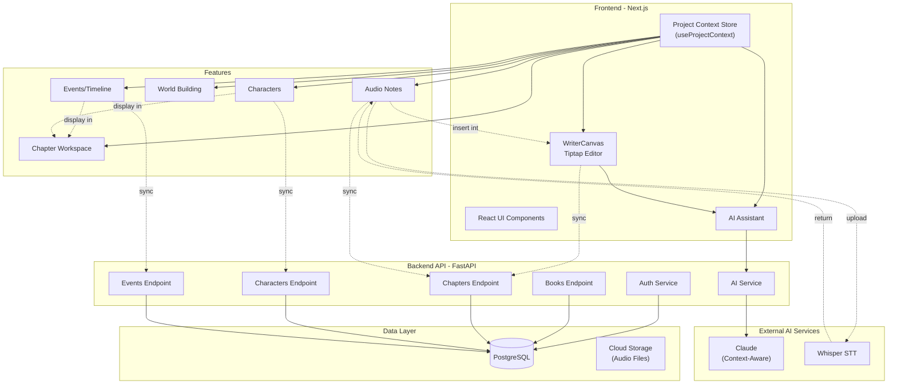

# Architecture Overview

## Current Architecture: Unified Data Context Model

AI Book Writer uses a **single unified data store** (Project Context) as the foundation. All features—editor, AI assistant, characters, world building, events, and audio—read from and write to this single source of truth. This ensures seamless integration and eliminates data silos.

## High-Level Architecture



## The Solution: Unified Data Model

### Core Concept: Project Context (`useProjectContext`)

Every component draws from and updates a single context store. No API calls needed for UI updates—all data lives in client state, synced to the backend asynchronously.

**Project Context Structure:**
```typescript
Book {
  id, title, metadata (genres, themes, writing_form, tone)
  ├── Chapter {
  │   id, title, draft_content, editor_state
  │   ├── characters_involved: [Character IDs]  ← Linked
  │   ├── world_elements: [WorldElement IDs]   ← Linked
  │   ├── events: [ChapterEvent]               ← Linked
  │   └── audio_notes: [AudioNote]            ← Linked
  │
  ├── Character {
  │   id, name, role, traits
  │   └── appearances: [Chapter IDs]           ← Reverse link
  │
  └── WorldElement {
      id, name, type, description
      └── appearances: [Chapter IDs]           ← Reverse link
}
```

### Why This Approach?
- **Single source of truth**: All UI reads from one store
- **Instant updates**: Change a character → All chapters see it immediately
- **No stale data**: Relationships stored bidirectionally
- **Context-aware AI**: AI has instant access to project metadata
- **Seamless integration**: Audio → Editor → AI all connected

## Four Layers of the Architecture

### Layer 1: Unified Data Store (`useProjectContext`)

**File:** `frontend/src/stores/project-context.ts`

This is the FOUNDATION. Everything reads from and writes to this single store.

**Core Store Structure:**
- **activeBook**: Current book metadata (genres, themes, tone, writing_form)
- **activeChapter**: Current chapter with draft_content and editor_state
- **characters[]**: All characters with name, role, traits, and chapter appearances
- **worldElements[]**: All world-building elements with descriptions
- **events[]**: All events with linked characters and world elements
- **audioNotes[]**: All audio transcriptions

**Why This Matters:**
- When you update a character name → All chapters display it instantly
- When you link a character to a chapter → Both sides know about it
- When you type in the editor → AI immediately sees new content
- When you transcribe audio → Content can be inserted directly into editor
- No API round-trips needed for UI updates → Instant, responsive interface

**Key Methods:**
```typescript
// Update content
updateChapterContent(chapterId, html)

// Add/link entities
addCharacter(character)
linkCharacterToChapter(characterId, chapterId)
addEventToChapter(chapterId, event)
addAudioNote(audioNote)

// Get AI context
getAiContextString() → Rich prompt for Claude
```

### Layer 2: Rich Editor (`WriterCanvas` - Tiptap)

**File:** `frontend/src/components/writer-canvas-tiptap.tsx`

Professional rich text editor replacing basic contenteditable.

**Features:**
- Tables, images, code blocks with syntax highlighting
- Task lists, multiple heading levels, bullet/numbered lists
- Full undo/redo
- Auto-syncs to Project Context on every keystroke
- Insert point for AI suggestions

**Integration:**
```jsx
<WriterCanvas
  chapterId="ch-123"
  initialContent={chapter.draft_content}
  onContentChange={(html) => updateChapterContent(chapterId, html)}
/>

// When content changes:
// WriterCanvas → updateChapterContent() → Project Context 
// → Propagates to AI, other components
// → Auto-save to backend every 5 seconds
```

### Layer 3: AI Assistant with Context (`AiAssistant`)

**File:** `frontend/src/components/ai-assistant.tsx`

The AI has access to FULL PROJECT CONTEXT via `getAiContextString()`.

**What the AI Receives:**
```
PROJECT METADATA:
  - Genres, themes, tone, writing style
  - Target audience, story structure

CURRENT CHAPTER:
  - Title, synopsis, current content
  - Word count, writing progress

CHARACTERS:
  - Names, roles, descriptions, personality traits
  - Where they appear (chapter list)
  - Relationship to other characters

WORLD ELEMENTS:
  - Locations, objects, concepts with descriptions
  - Where they appear (chapter list)
  - Connections to other elements

RECENT EVENTS:
  - Chronological list of key events
  - Characters involved in each event
  - Context and consequences
```

**Why This Works:**
- AI understands your project's tone, genre, and themes
- Suggestions are consistent with established characters and world
- Dialogue respects character personalities
- World-building references existing elements
- Suggestions feel natural, not generic

**AI Endpoints:**
1. **POST /api/v1/ai/chat** - Chat with Claude (main interface)
2. **POST /api/v1/ai/style-guide** - Generate style guidelines
3. **POST /api/v1/ai/writing-prompts** - Generate chapter prompts

### Layer 4: Backend AI Integration (`backend/app/api/v1/ai.py`)

FastAPI endpoints that receive rich context from frontend and call Claude.

**Services:**
- **Auth Service**: JWT authentication, user management
- **Books Endpoint**: CRUD operations on books
- **Chapters Endpoint**: CRUD operations on chapters  
- **Characters Endpoint**: CRUD operations on characters
- **Events Endpoint**: CRUD operations on events
- **AI Service**: Context-aware Claude integration
- **STT Service**: Whisper API integration for audio transcription

## Data Flow Examples

### Example 1: Writing in the Editor (Instant Sync)

```
User types in WriterCanvas
   ↓
Tiptap onUpdate fires
   ↓
updateChapterContent(chapterId, html) called
   ↓
Project Context updates activeChapter.draft_content
   ↓
All components re-render with new content:
   - AI Assistant sees new context in getAiContextString()
   - Chapter workspace displays updated content
   - Any linked world elements show context
   ↓
Auto-save to database every 5 seconds
```

### Example 2: AI Suggests Dialogue

```
User asks AI: "Help with dialogue between Aria and Thomas"
   ↓
AiAssistant captures:
  - Full project context (genres, tone, characters, past events)
  - User message
  - System prompt (specialized for dialogue)
   ↓
Claude API receives rich context and responds
   ↓
Claude provides dialogue suggestions
   ↓
User clicks "Insert" button
   ↓
Content inserted into WriterCanvas at cursor position
   ↓
Tiptap onUpdate fires → context updates → document syncs to backend
```

### Example 3: Audio Transcription Becomes Chapter Content

```
User records audio note in Audio section
   ↓
Audio uploaded to backend
   ↓
STT service (Whisper) transcribes to text
   ↓
Transcription returned to frontend
   ↓
addAudioNote() updates Project Context
   ↓
Audio component displays transcription
   ↓
User clicks "Insert into chapter"
   ↓
insertContent() called on WriterCanvas
   ↓
Text appears in editor at cursor position
   ↓
Tiptap onUpdate fires, context updates, document syncs
   ↓
User can refine or ask AI for suggestions
```

### Example 4: Create Character, Use Everywhere

```
User adds character "Marcus" in Characters section
   ↓
addCharacter() updates Project Context
   ↓
All components re-render:
  - Character appears in characters[] list
  - Available for linking to chapters
  - Available for AI context
   ↓
User links Marcus to Chapter 5
   ↓
linkCharacterToChapter(characterId, chapterId)
   ↓
Chapter 5 now shows Marcus in characters_involved: [...]
   ↓
AI gets context and can reference Marcus when suggesting dialogue
   ↓
Chapter workspace displays Marcus in "Characters in this chapter"
   ↓
World Building sees Marcus mentioned in Chapter 5
```

## Component Relationships

```
┌─────────────────────────────────────────────────────────┐
│  PROJECT CONTEXT STORE (useProjectContext)             │
│  - Single source of truth for all data                 │
│  - Instant updates across all components               │
│  - All relationships stored here                       │
├─────────────────────────────────────────────────────────┤
│                                                         │
├─→ WriterCanvas (Tiptap)                               │
│   └─→ Reads: chapter.draft_content                    │
│   └─→ Writes: updateChapterContent()                  │
│   └─→ Syncs: Save to backend every 5 seconds          │
│                                                         │
├─→ AiAssistant                                          │
│   └─→ Reads: ALL context for prompts                  │
│   └─→ Calls: /api/v1/ai/chat                          │
│   └─→ Writes: onInsertContent() to editor             │
│                                                         │
├─→ Characters Component                                 │
│   └─→ Reads: characters[]                             │
│   └─→ Writes: addCharacter()                          │
│   └─→ Links: linkCharacterToChapter()                 │
│                                                         │
├─→ World Building Component                             │
│   └─→ Reads: worldElements[]                          │
│   └─→ Writes: addWorldElement()                       │
│   └─→ Links: linkWorldElementToChapter()              │
│                                                         │
├─→ Events/Timeline Component                            │
│   └─→ Reads: chapter.events[]                         │
│   └─→ Writes: addEventToChapter()                     │
│   └─→ Links: linkEventToCharacters()                  │
│                                                         │
└─→ Audio Notes Component                                │
    └─→ Reads: audioNotes[]                             │
    └─→ Writes: addAudioNote()                          │
    └─→ Links: insertContent() to WriterCanvas          │
```

## Using the Architecture

### In Any Component:

```typescript
import { useProjectContext } from '@/stores/project-context';

const {
  activeBook,        // Current book
  activeChapter,     // Current chapter with draft_content
  characters,        // All characters
  worldElements,     // All world elements
  
  // Methods to update
  updateChapterContent(chapterId, html),
  addCharacter(character),
  linkCharacterToChapter(characterId, chapterId),
  addEventToChapter(chapterId, event),
  addAudioNote(audioNote),
  
  // Get rich context for AI
  getAiContextString(),
} = useProjectContext();
```

### What Gets Synced Automatically

When you:
- **Change chapter content** → All components see it instantly, auto-saves to backend
- **Update character info** → AI and all chapters reflect it immediately
- **Add event to chapter** → Characters & world building pages see it
- **Link entities** → Relationship stored both ways
- **Save transcription** → Can be inserted into chapter

**No manual refreshing. No stale data. One source of truth.**

## Backend Database Schema

The backend persists the Project Context to PostgreSQL:

**Core Tables:**
- **books**: Project metadata (genres, themes, tone, etc.)
- **chapters**: Chapter content from WriterCanvas
- **characters**: Character definitions with descriptions
- **world_elements**: World-building elements
- **events**: Events with linked characters and world elements
- **chapter_characters**: Links characters to chapters
- **chapter_events**: Links events to chapters
- **audio_files**: Upload metadata
- **transcriptions**: STT results from Whisper

**All synced from the frontend Project Context via REST API**

## Why This Architecture Works

### ✅ Single Unified Model
- Everything reads from one store
- Change once → Updates everywhere

### ✅ Real-Time Responsiveness
- No API round-trips for UI updates
- Instant character/world changes visible
- Editor feels snappy and responsive

### ✅ Context-Aware AI
- Claude receives full project context
- Suggestions are genre/tone/character-consistent
- Understands your writing style and world

### ✅ Seamless Integration
- Audio → Editor → AI all connected
- No data silos or isolated features
- Consistent experience across the app

### ✅ Automatic Sync
- Editor changes auto-save every 5 seconds
- All other updates sync on change
- Backend stays in sync with UI

## Frontend Directory Structure

```
frontend/
├── src/
│   ├── app/
│   │   ├── globals.css
│   │   ├── layout.tsx
│   │   ├── page.tsx
│   │   ├── dashboard/
│   │   ├── login/
│   │   └── register/
│   ├── components/
│   │   ├── ai-assistant.tsx          ← AI Suggestions (Layer 3)
│   │   ├── writer-canvas-tiptap.tsx  ← Rich Editor (Layer 2)
│   │   ├── layout/
│   │   └── ui/
│   ├── lib/
│   │   ├── api-client.ts             ← API calls to backend
│   │   └── utils.ts
│   └── stores/
│        └── project-context.ts        ← Project Context Store (Layer 1)
```

## Backend Directory Structure

```
backend/
├── app/
│   ├── api/
│   │   └── v1/
│   │       ├── auth.py               ← Authentication
│   │       ├── ai.py                 ← AI endpoints (Layer 4)
│   │       ├── books.py              ← Book CRUD
│   │       ├── chapters.py           ← Chapter CRUD
│   │       ├── characters.py         ← Character CRUD
│   │       └── events.py             ← Event CRUD
│   ├── core/
│   │   ├── config.py
│   │   ├── database.py
│   │   └── security.py
│   ├── models/
│   │   ├── book.py
│   │   ├── chapter.py
│   │   ├── character.py
│   │   ├── event.py
│   │   └── user.py
│   ├── schemas/
│   │   └── ... (Pydantic models)
│   ├── services/
│   │   ├── llm/
│   │   │   └── claude_service.py     ← Claude API calls
│   │   └── stt/
│   │       └── whisper_service.py    ← Audio transcription
│   └── main.py
```

## Deployment

**Frontend:**
- Vercel (recommended)
- Docker container
- Any static hosting with API reverse proxy

**Backend:**
- Docker container
- Google Cloud Run
- AWS App Runner
- Any server with Python 3.11+

**External Services:**
- Claude API (Anthropic)
- Whisper API (OpenAI)
- PostgreSQL database
- Cloud storage for audio files
